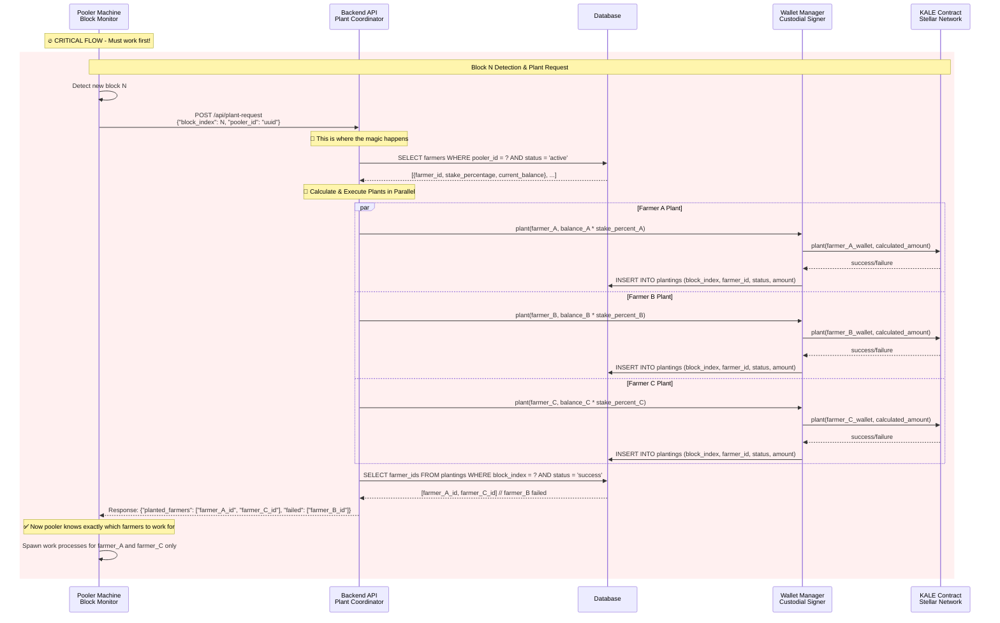

```mermaid
sequenceDiagram
    participant PM as Pooler Machine<br/>Block Monitor
    participant API as Backend API<br/>Plant Coordinator
    participant DB as Database
    participant WM as Wallet Manager<br/>Custodial Signer
    participant KALE as KALE Contract<br/>Stellar Network
    
    Note over PM: 🔥 CRITICAL FLOW - Must work first!
    
    rect rgb(255, 240, 240)
        Note over PM,KALE: Block N Detection & Plant Request
        PM->>PM: Detect new block N
        PM->>API: POST /api/plant-request<br/>{"block_index": N, "pooler_id": "uuid"}
        
        Note over API: 🧠 This is where the magic happens
        API->>DB: SELECT farmers WHERE pooler_id = ? AND status = 'active'
        DB-->>API: [{farmer_id, stake_percentage, current_balance}, ...]
        
        Note over API: 🌱 Calculate & Execute Plants in Parallel
        
        par Farmer A Plant
            API->>WM: plant(farmer_A, balance_A * stake_percent_A)
            WM->>KALE: plant(farmer_A_wallet, calculated_amount)
            KALE-->>WM: success/failure
            WM->>DB: INSERT INTO plantings (block_index, farmer_id, status, amount)
        and Farmer B Plant  
            API->>WM: plant(farmer_B, balance_B * stake_percent_B)
            WM->>KALE: plant(farmer_B_wallet, calculated_amount)
            KALE-->>WM: success/failure
            WM->>DB: INSERT INTO plantings (block_index, farmer_id, status, amount)
        and Farmer C Plant
            API->>WM: plant(farmer_C, balance_C * stake_percent_C) 
            WM->>KALE: plant(farmer_C_wallet, calculated_amount)
            KALE-->>WM: success/failure
            WM->>DB: INSERT INTO plantings (block_index, farmer_id, status, amount)
        end
        
        API->>DB: SELECT farmer_ids FROM plantings WHERE block_index = ? AND status = 'success'
        DB-->>API: [farmer_A_id, farmer_C_id] // farmer_B failed
        
        API-->>PM: Response: {"planted_farmers": ["farmer_A_id", "farmer_C_id"], "failed": ["farmer_B_id"]}
        
        Note over PM: ✅ Now pooler knows exactly which farmers to work for
        PM->>PM: Spawn work processes for farmer_A and farmer_C only
    end
```
