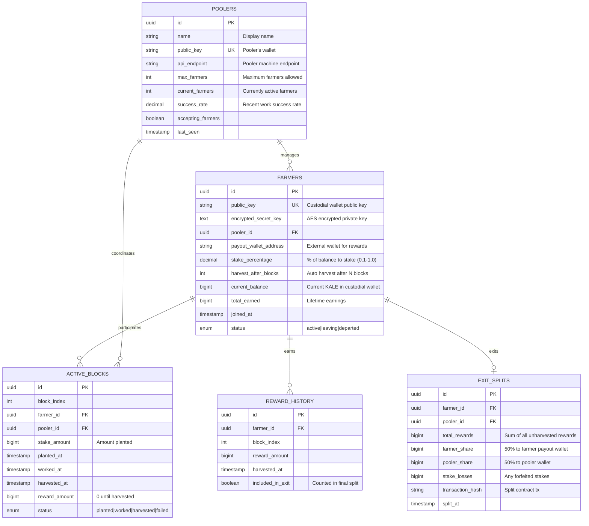
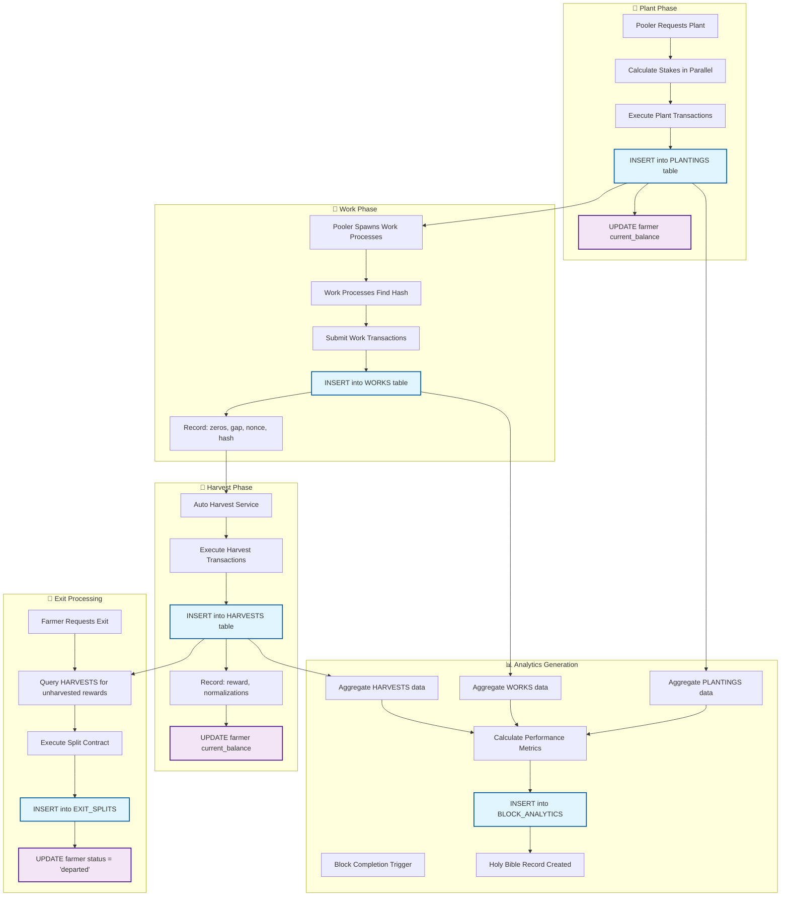

```mermaid
erDiagram
    FARMERS {
        uuid id PK
        string public_key UK "Custodial wallet public key"
        text encrypted_secret_key "AES encrypted private key"
        uuid pooler_id FK
        string payout_wallet_address "External wallet for rewards"
        decimal stake_percentage "% of balance to stake (0.1-1.0)"
        int harvest_after_blocks "Auto harvest after N blocks"
        bigint current_balance "Current KALE in custodial wallet"
        bigint total_earned "Lifetime earnings"
        timestamp joined_at
        enum status "active|leaving|departed"
    }
    
    POOLERS {
        uuid id PK
        string name "Display name"
        string public_key UK "Pooler's wallet"
        string api_endpoint "Pooler machine endpoint"
        int max_farmers "Maximum farmers allowed"
        int current_farmers "Currently active farmers"
        decimal success_rate "Recent work success rate"
        boolean accepting_farmers
        timestamp last_seen
    }
    
    ACTIVE_BLOCKS {
        uuid id PK
        int block_index 
        uuid farmer_id FK
        uuid pooler_id FK
        bigint stake_amount "Amount planted"
        timestamp planted_at
        timestamp worked_at
        timestamp harvested_at
        bigint reward_amount "0 until harvested"
        enum status "planted|worked|harvested|failed"
    }
    
    REWARD_HISTORY {
        uuid id PK
        uuid farmer_id FK
        int block_index
        bigint reward_amount
        timestamp harvested_at
        boolean included_in_exit "Counted in final split"
    }
    
    EXIT_SPLITS {
        uuid id PK
        uuid farmer_id FK
        uuid pooler_id FK
        bigint total_rewards "Sum of all unharvested rewards"
        bigint farmer_share "50% to farmer payout wallet"
        bigint pooler_share "50% to pooler wallet"
        bigint stake_losses "Any forfeited stakes"
        string transaction_hash "Split contract tx"
        timestamp split_at
    }
    
    FARMERS ||--o{ ACTIVE_BLOCKS : participates
    FARMERS ||--o{ REWARD_HISTORY : earns
    FARMERS ||--o| EXIT_SPLITS : exits
    POOLERS ||--o{ FARMERS : manages
    POOLERS ||--o{ ACTIVE_BLOCKS : coordinates
```

```mermaid
flowchart TB
    subgraph "🌱 Plant Phase"
        P1[Pooler Requests Plant]
        P2[Calculate Stakes in Parallel]
        P3[Execute Plant Transactions]
        P4[INSERT into PLANTINGS table]
        P5[UPDATE farmer current_balance]
    end
    
    subgraph "💪 Work Phase"  
        W1[Pooler Spawns Work Processes]
        W2[Work Processes Find Hash]
        W3[Submit Work Transactions]
        W4[INSERT into WORKS table]
        W5[Record: zeros, gap, nonce, hash]
    end
    
    subgraph "🚜 Harvest Phase"
        H1[Auto Harvest Service]
        H2[Execute Harvest Transactions]
        H3[INSERT into HARVESTS table]
        H4[Record: reward, normalizations]
        H5[UPDATE farmer current_balance]
    end
    
    subgraph "📊 Analytics Generation"
        A1[Block Completion Trigger]
        A2[Aggregate PLANTINGS data]
        A3[Aggregate WORKS data] 
        A4[Aggregate HARVESTS data]
        A5[Calculate Performance Metrics]
        A6[INSERT into BLOCK_ANALYTICS]
        A7[Holy Bible Record Created]
    end
    
    subgraph "🚪 Exit Processing"
        E1[Farmer Requests Exit]
        E2[Query HARVESTS for unharvested rewards]
        E3[Execute Split Contract]
        E4[INSERT into EXIT_SPLITS]
        E5[UPDATE farmer status = 'departed']
    end
    
    %% Phase Dependencies
    P1 --> P2 --> P3 --> P4 --> P5
    P4 --> W1
    W1 --> W2 --> W3 --> W4 --> W5
    W5 --> H1
    H1 --> H2 --> H3 --> H4 --> H5
    
    %% Analytics Triggers
    P4 --> A2
    W4 --> A3
    H3 --> A4
    A2 --> A5
    A3 --> A5
    A4 --> A5
    A5 --> A6 --> A7
    
    %% Exit Flow
    H3 --> E2
    E1 --> E2 --> E3 --> E4 --> E5
    
    %% Data Integrity Notes
    classDef immutable fill:#e1f5fe,stroke:#01579b,stroke-width:2px
    classDef mutable fill:#f3e5f5,stroke:#4a148c,stroke-width:2px
    
    class P4,W4,H3,A6,E4 immutable
    class P5,H5,E5 mutable
```