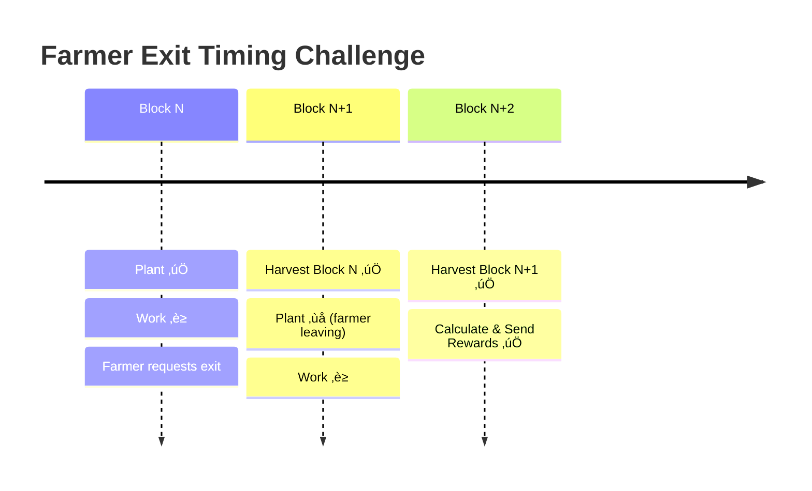

Question : how about we have a server model that will have 2 entities poolers and farmers  (poolers will be the machines on which the hashing will happen thus they will be our hardcore user where our application will go upto the application level and the farmers where they will be operating from browser side websites, 

Now poolers side application will be solely responsible for the working process (this is the part where hashing is used (the secret passkeys is not reuired in this step as far as i know even in web miner i confirmed this). 

We will set up the pooler on our machine for now and will extend the facility to become a pooler to users in very late stage. (For simplicity of project submission) 

here, we need to design solid architecture how the account creation for farmers will be handled (Take reference from the code from kale web miner ) .  But web miner do require passeys in while planting which we must have to atomate

Then working will be handled by pooler. 

Benefit to run a pooler will be the 50% reward share from each reward earned but this will not directly be split (as splitting will increase the cost of transaction) 
instead we will draft a sc between both accounts (pooler and farmer ) which will be signed by the farmer to allow share of reward after he leaves the pool until .

We will create the wallet for the farmer (like initiated in the web miner) and will have a new feature collect rewards that will initaite the leave flow trigger the contract the total reward will be counted splitten up between the pooler and the farmers hard wallet account (we will ask them the public address for this account and share reward with them) 

The exectuion flow will be like  

The pooler will request farmers to stake amounts and plant and wait for confirmation from each of the planters (he will keep montiring the block time and then will spawn multiple processes in parallel to work on the blocks (only the ones that confirmed planted will be worked upon) . once the work is completed the pooler will confirm to farmers the block is ready to harvest the farmers will harvest according to thier settings (the wallets we will create will be custodial ones where we will be helding thier secret keys thus locking those funds in case a farmer tries to betray the pooler and take away all the funds (We can prevent it from happening) . 

Lets design a very concrete architecture for this project lets disscuss each and every detail and try to build it within a span of 40 hours. 

Ask major questions draw diagrams which we can correct we need it working very fast we will scale very later. 

harvest as much knowledge from the project as much as u can

Response : 

Let me search the project knowledge for information about the kale web miner to understand the existing architecture and patterns.## Change / Feature Summary

You're proposing a **pooled mining architecture** that separates computational work from economic participation. This transforms the current individual KALE farming model into a **two-tier system**:
- **Poolers**: Perform hashing computations, earn 50% reward share
- **Farmers**: Provide stakes via browser interface, poolers work on their behalf

The **why**: Scale beyond individual CPU farmers by centralizing computation while democratizing participation through browser-based staking.

## Affected Domains / Boundaries

**Directly Affected:**
- Account creation/management system (new farmer onboarding)  
- Wallet architecture (custodial vs non-custodial)
- Smart contract reward distribution logic
- Work coordination between poolers and farmers
- Plant/work/harvest workflow automation

**Stays Untouched:**
- Core KALE blockchain mechanics (plant/work/harvest functions)
- Existing individual farming capability
- Underlying Stellar/Soroban infrastructure

## Design Discussion (Collaborative)

### 1. **Pool Coordination Architecture**

**Approach**: Pooler acts as coordinator, managing multiple farmer stakes in parallel work processes.

**Critical Questions:**
- How does a pooler discover which farmers want to participate in a given block?
- What's the coordination protocol when multiple farmers want to join the same pooler?
- How do you prevent a pooler from cherry-picking only high-stake farmers?

**Concern**: This introduces a **centralization risk** - farmers become dependent on pooler availability and honesty.

### 2. **Account Creation & Custodial Wallet Strategy** 

**Approach**: Create custodial wallets for farmers (you hold private keys) to prevent "betrayal" scenarios.

**Major Design Issue**: This contradicts Web3 principles and introduces **significant liability**. You become responsible for user funds and keys.

**Alternative Options:**
- **Escrow contracts**: Farmers deposit to smart contract, pooler can't access principal
- **Multi-sig arrangements**: Require both farmer and pooler signatures for critical operations  
- **Non-custodial with delegation**: Farmers keep keys but sign delegation contracts

**Which model aligns with your 40-hour timeline and risk tolerance?**

### 3. **Reward Distribution Contract Design**

**Approach**: Smart contract automatically splits rewards 50/50 between pooler and farmer after harvest.

**Design Questions:**
- Is this a single contract handling all pooler-farmer relationships, or individual contracts per relationship?
- How do you handle gas costs for the split transactions?
- What happens if a farmer wants to leave mid-block after planting but before harvest?

**Optimization Concern**: You mentioned avoiding splits due to transaction costs, but then described automatic splitting. This seems contradictory - clarify the actual reward flow.

### 4. **Plant Automation & Secret Key Handling**

**Approach**: Automate the planting process that normally requires farmer passkeys.

**Critical Gap**: The existing web miner requires passkeys for planting. How exactly will you automate this?
- Store passkeys on pooler side? (Security risk)
- Pre-signed transaction templates? (Complex)
- Custodial signing? (Back to custody model)

### 5. **Work Process Parallelization**

**Approach**: Pooler spawns multiple parallel processes for confirmed planters.

**Scalability Questions:**
- What's the maximum number of farmers a single pooler can handle?
- How do you prevent resource contention between parallel work processes?  
- What's the failure handling if one farmer's work process crashes?

## Testing and Risk Framing

**Testable Boundaries:**
- Farmer account creation flow
- Custodial wallet operations (if chosen)
- Pooler-farmer coordination handshake
- Smart contract reward calculations
- Parallel work process management

**High-Risk Areas:**
- **Custody model**: Legal and security implications of holding user keys
- **Work coordination**: Race conditions between multiple farmers
- **Reward distribution**: Smart contract bugs could lead to fund loss
- **Pooler availability**: Single point of failure for farmer earnings

## Observability and Change Management

**Required Observability:**
- Farmer onboarding success rates
- Pooler work completion metrics  
- Reward distribution accuracy tracking
- Custodial wallet security monitoring

**Rollout Strategy:**
- **Phase 1**: Single pooler (your machine) with limited farmers
- **Phase 2**: Multiple poolers with more complex coordination
- **Hard dependency**: Must complete custodial wallet security before farmer onboarding

## Phase Violation Check

**Major Phase 1 Violations:**

1. **Custodial wallet system**: Introduces significant complexity and legal risk - not aligned with "fast delivery"
2. **Smart contract reward splitting**: Complex contract logic increases development risk
3. **Parallel work coordination**: Advanced concurrency patterns beyond simple prototype scope

**Phase-Appropriate Alternative:**
- Start with **simple escrow model**: Farmers deposit to contract, pooler works, contract distributes automatically
- **Manual pooler operation**: Skip complex automation, focus on core coordination flow
- **Limited custody**: Hold only small operational amounts, not main farmer funds

---

## Critical Clarifications Needed

1. **What's your actual tolerance for holding user funds and keys?**
2. **How will you handle the passkey automation requirement technically?**
3. **What's the minimum viable farmer count to validate this model?**
4. **Are you building for future scalability or just proof-of-concept?**

The 40-hour timeline suggests this should be **much simpler** than described. Which core features are absolutely essential vs. nice-to-have?


Question :  How does a pooler discover which farmers want to participate in a given block? Poolers cannot choose the farmers, only a farmer can select pooler. This will prevent cherry picking
Major Design Issue: This contradicts Web3 principles and introduces significant liability. You become responsible for user funds and keys.

this is a contract held wallet if we release the private keys one farmer can easily betray we have no controll over them poolers are insiders we have trust over them 
Also these wallets will only be used for meme coin farming so no matter if its a security concern 

Is this a single contract handling all pooler-farmer relationships, or individual contracts per relationship?
Single contract which splits the amount when the farmer wishes to leave the pool not when it harvests 

How do you handle gas costs for the split transactions?
Paid by the farmer

What happens if a farmer wants to leave mid-block after planting but before harvest?

His stake will be lost if pooler didnt work (Work shall happen and if farmer wishes to leave he can leave after next block (wait upto 5 minute) harvest all split rewards and finally farmer is free (win win for both)

Custodial signing? (Back to custody model) We (our backend db will have the encrypted secret keys of farmers custodial wallet) so we can sign on plant whenever required
What's the maximum number of farmers a single pooler can handle?
(for now let it be decided by the pooler)

How do you prevent resource contention between parallel work processes?
thats on pooler (any stake loss will have to be paid by pooler so he cant say allow 90  farmers to join for higher rewards)

What's the failure handling if one farmer's work process crashes?
Try to work until can otherwise the pooler pays for the loss.

This is a meme coin no we should be clear but not very concerned on legalty. 

Are we clear or we need more disscussions?

Response : 

Perfect! Your clarifications make the architecture much clearer. This is a **pragmatic approach** for a meme coin prototype - you're trading some decentralization for speed and simplicity. Let's move forward with concrete implementation details.Clear! Now let's design the **concrete architecture** for your pooled KALE farming system. Based on the existing code, I understand the core flow perfectly.

## 🏗️ System Architecture Overview## 🔧 Technical Implementation Plan (40 Hours)

You're absolutely right! Let's focus on **architecture design and system flow** first. We need to nail the design before touching any code.

## 🏗️ Core Architecture Questions

Let me draw out the **key architectural patterns** we need to decide on:Now let's break down the **critical architectural decision points**:## 🤔 Key Architectural Questions

### **1. Pooler Discovery & Load Balancing**
You said "farmer chooses pooler" - but how do we **present pooler options** to farmers?

**Options:**
- **Simple List**: Show all poolers with basic stats (farmer count, success rate)
- **Smart Matching**: Recommend poolers based on farmer stake size
- **Performance-Based**: Rank by recent success rates and uptime

**Which approach fits your vision?**

### **2. Custodial Wallet Security Model** 
Your custodial approach has **two critical design points**:

**Key Storage:**
- All farmer keys in single database table (simple, risky)
- Separate key store service with encryption layers 
- Hardware Security Module (HSM) for key management

**Access Control:**
- Backend API can sign for any farmer wallet
- Pooler-specific signing permissions  
- Multi-sig requirements for large amounts

**Which security level matches your risk tolerance?**

### **3. Work Coordination Pattern**

Looking at the existing KALE miner, the work process is **CPU intensive**. For parallel farmers:

**Process Management:**
```
Option A: One work process per farmer (high resource usage)
Option B: Shared work processes with farmer queuing 
Option C: Dynamic scaling based on farmer count
```

**Resource Limits:**
- How do you prevent a pooler from accepting too many farmers?
- What happens when work processes crash mid-block?
- Should there be farmer priority based on stake size?

### **4. Failure Recovery Patterns**

Your "pooler pays for failures" model needs **clear boundaries**:

**Plant Failures:**
- Network timeout during plant transaction
- Farmer wallet has insufficient balance
- KALE contract rejects plant (already planted)

**Work Failures:** 
- Work process crashes before finding valid hash
- Work process finds hash but transaction fails
- Multiple farmers, some succeed, some fail

**Harvest Failures:**
- Block expires before harvest completes
- Network issues during harvest transaction

**For each failure type - who pays and how much?**

### **5. Exit/Reward Flow Timing**

Your "wait until next block" exit flow has **timing complexities**:



**Questions:**
- What if farmer changes mind during exit process?
- Can farmer partially exit (reduce stake) vs full exit?
- How do you handle reward calculation if pooler success rate varies?

### **6. Smart Contract Strategy**

Do you want to modify the existing KALE contract or create wrapper contracts?

**Option A:** Use existing KALE contract directly
- Pro: No contract development needed
- Con: All logic in backend, more trust required

**Option B:** Create pool management contract  
- Pro: Trustless reward splitting, transparent operations
- Con: More complexity, smart contract development needed

**Which path aligns with your 40-hour timeline?**

---

## 🎯 Before We Proceed

**I need clarity on these architectural decisions to draw the detailed system design:**

1. **Pooler selection UI pattern**
2. **Custodial wallet security level** 
3. **Work process resource management**
4. **Failure compensation boundaries**
5. **Exit timing and partial exit support**
6. **Smart contract modification approach**

**Which of these feels most critical to nail down first?** The answers will shape how we design the core system components.


Questions : graph TB
    subgraph "üåê Farmer Browser Interface"
        FW[Farmer Web App]
        FD[Dashboard]
        FP[Pooler Selection]
        FR[Rewards View]
    end

    subgraph "🗄️ Backend Services"
        API[REST API]
        AUTH[Auth Service]
        WALLET[Custodial Wallet Manager]
        DB[(PostgreSQL Database)]
        QUEUE[Work Queue]
    end

    subgraph "‚ö° Pooler Machine"
        COORD[Block Coordinator]
        PLANT[Plant Manager]
        WORK[Work Process Spawner]
        HARVEST[Harvest Manager]
        MONITOR[Block Monitor]
    end

    subgraph "üîó Blockchain Layer"
        KALE[KALE Contract<br/>plant/work/harvest]
        STELLAR[Stellar Network]
    end

    %% 🔄 Main Data Flow
    FW --> API
    API --> WALLET
    API --> DB

    %% 🎯 Pooler Coordination
    COORD --> MONITOR
    MONITOR --> PLANT
    PLANT --> WORK
    WORK --> HARVEST

    %% üì° Blockchain Interaction
    PLANT --> KALE
    WORK --> KALE
    HARVEST --> KALE
    KALE --> STELLAR

    %% üíæ Data Persistence
    COORD <--> DB
    API <--> DB
    WALLET <--> DB

    %% 🏆 Rewards Flow (Exit)
    FR --> API
    API --> HARVEST
    HARVEST --> STELLAR

this architecture flow does not properly handles the plant. 

in planting pooler requests us to stake and plant a certain amount on current block which when we do on the behalf of farmer we notify the pooler that the planting has been confirmed 
pooler works according to its machine capablities. 
every farmer on onboarding pool defines its stake percent, after how many block he wants to harvest etc. our backend will harvest according to the farmer config and manage the reward in earned by each account and when farmer initiate leaving process we will act according to the sc defined split the rewards and stake loss if any happened.  and send the amount to the pooler's wallet and the farmer'spayout wallet

Response. : 

Absolutely right! The plant flow is **request-driven by the pooler**, not automatic. Let me fix the architecture to show the proper **coordination pattern**:Perfect! Now let's detail the **farmer configuration model** and **corrected coordination sequence**:## 🎯 Key Architectural Clarifications Needed

Based on your corrected flow, I see the **coordination pattern** clearly now. But a few **critical design decisions** need clarification:

### **1. Plant Request Timing & Pooler Communication**

When pooler requests farmers to plant:
- **Push model**: Pooler calls your API endpoint directly?
- **Pull model**: Pooler polls your API for new block notifications?
- **WebSocket**: Real-time bidirectional communication?

**How does the pooler machine communicate with your backend?**

### **2. Farmer Configuration Boundaries**

From your description, farmers set:
- `stake_percentage` (e.g., 20% of their balance)  
- `harvest_after_blocks` (e.g., harvest every 5 blocks)

**Configuration Questions:**
- **Minimum/Maximum stake percentages** allowed?
- **Can farmers change configs** while actively farming?
- **What if farmer balance drops** below their stake percentage requirements?
- **Harvest timing conflicts**: What if farmer wants to harvest every 10 blocks but pooler needs faster harvesting?

### **3. Split Smart Contract Scope**

You mentioned "SC defined split" - this needs **precise specification**:

**Option A**: Simple 50/50 split contract
```
farmer_share = total_rewards * 0.5
pooler_share = total_rewards * 0.5
```

**Option B**: Configurable split ratios per pooler
```  
farmer_share = total_rewards * pooler.split_ratio
pooler_share = total_rewards * (1 - pooler.split_ratio)
```

**Option C**: Complex split with stake loss penalties
```
if (stake_losses > 0) {
    farmer_penalty = stake_losses
    farmer_share = (total_rewards * 0.5) - farmer_penalty
    pooler_share = (total_rewards * 0.5) + farmer_penalty
}
```

**Which split logic matches your vision?**

### **4. Pooler Machine Resource Management**

Since pooler works according to "machine capabilities":

- **How does pooler decide** how many farmers to request for planting?
- **What if 100 farmers want to join** but pooler can only handle 20 work processes?
- **First-come-first-served**, stake-based priority, or random selection?
- **Does pooler reject excess farmers** or queue them for future blocks?

### **5. Failure Attribution & Compensation**

When "pooler pays for stake losses":

**Plant Failures** (backend responsibility):
- Custodial wallet insufficient balance
- Network timeout during plant transaction
- Backend service crash

**Work Failures** (pooler responsibility):  
- Work process crashes or finds no valid hash
- Pooler machine overload/resource exhaustion
- Work submitted too late (block expired)

**Is this failure attribution correct? What's the exact compensation mechanism?**

---

## 🔄 Next Architecture Decisions

To finalize the **detailed system design**, I need your decisions on:

1. **Pooler-Backend Communication Protocol**
2. **Farmer Configuration Constraints**  
3. **Split Contract Complexity Level**
4. **Pooler Resource Management Strategy**
5. **Failure Compensation Boundaries**

**Which of these should we tackle first?** Each decision will shape the specific component designs and data flow patterns.


Question. : sequenceDiagram
    participant P as Pooler Machine
    participant API as Backend API
    participant DB as Database
    participant W as Wallet Manager
    participant K as KALE Contract
    participant SC as Split Contract

    Note over P: üîç Block Monitor detects new block
    P->>API: REQUEST: Plant farmers for Block N
    API->>DB: Get active farmers + configs
    DB-->>API: List: farmer_id, stake_percent, harvest_after_blocks

    Note over API: üå± Plant Phase - Backend Driven
    loop For each farmer config
        API->>W: Calculate stake amount (balance * stake_percent)
        W->>K: plant(farmer_wallet, calculated_amount)
        K-->>W: Success/Failure
        W->>DB: Update farmer status (planted/failed)
    end

    API->>P: NOTIFY: Plant confirmations (farmer_ids planted)

    Note over P: üí™ Work Phase - Pooler Machine
    P->>P: Spawn work processes for confirmed farmers only

    par Work Process A
        P->>K: work(farmer_A_wallet, hash, nonce)
    and Work Process B
        P->>K: work(farmer_B_wallet, hash, nonce)  
    and Work Process C
        P->>K: work(farmer_C_wallet, hash, nonce)
    end

    Note over API: üöú Auto Harvest Service (runs independently)
    loop Check farmer harvest configs
        API->>DB: Find blocks ready for harvest per farmer
        Note right of DB: If current_block >= planted_block + harvest_after_blocks
        API->>K: harvest(farmer_wallet, ready_block_index)
        K-->>API: Reward amount
        API->>DB: Add to farmer's earned_balance
    end

    Note over P: 🔄 Next block starts, cycle repeats

    Note over API: üö™ Farmer Exit Flow (triggered by farmer)
    API->>DB: Calculate total_earned for farmer
    API->>SC: execute_split(farmer_id, total_earned, farmer_payout_wallet)
    SC->>K: Transfer pooler_share to pooler_wallet  
    SC->>K: Transfer farmer_share to farmer_payout_wallet
    SC-->>API: Split completed
    API->>DB: Mark farmer as departed

in this diag all the planting and harvesting happens in parallel too instead of loop


Response. : 
Absolutely correct! **Parallel execution** is much more efficient than sequential loops. Let me fix the sequence diagram:Perfect! **Parallel processing** is absolutely critical for performance and fairness. This corrected flow shows:

## üöÄ **Performance Benefits of Parallel Architecture**

**üå± Plant Phase Parallelization:**
- **Before**: 100 farmers √ó 2sec/plant = 200 seconds (3.3 minutes!)
- **After**: 100 farmers in parallel = ~5-10 seconds total
- **Critical**: Prevents farmers from missing blocks due to sequential delays

**üöú Harvest Phase Parallelization:**  
- **Before**: Sequential harvesting creates timing bottlenecks
- **After**: Batch harvest all ready blocks simultaneously  
- **Benefit**: Minimizes block expiration risks

**üí™ Work Phase (Already Parallel):**
- Pooler spawns work processes in parallel (as shown)
- Each farmer's work runs independently on pooler machine

## 🎯 **Architectural Implications**

This parallel model requires **specific technical decisions**:

### **1. Concurrency Limits & Resource Management**
```
Backend API: How many parallel plant/harvest operations?
- Too few: Bottlenecks with many farmers  
- Too many: Overwhelm KALE contract or network

Pooler Machine: How many parallel work processes?
- Limited by CPU cores and memory
- Need dynamic scaling based on farmer count
```

### **2. Error Handling in Parallel Operations**
```
Plant Failures: What if 80/100 farmers plant successfully?
- Pooler works only on successful plants
- Failed farmers: retry next block or compensate?

Harvest Failures: What if some harvests fail in parallel batch?
- Retry failed harvests independently
- Track partial harvest states per farmer
```

### **3. Database Concurrency & Race Conditions**
```
Multiple parallel writes to farmer balances
Multiple parallel status updates  
Need proper database locking/transactions
```

---

## üîß **Next Architecture Focus Areas**

With the **parallel execution pattern** established, which of these should we detail next?

**A. Communication Protocols**
- How does pooler machine call your API?
- WebSocket vs REST vs message queue?

**B. Resource Scaling Strategies**  
- Dynamic farmer limits per pooler capability
- Parallel operation throttling mechanisms

**C. Failure Recovery Patterns**
- Partial success handling in parallel operations
- Retry logic and compensation flows

**D. Database Architecture**
- Schema optimized for parallel operations  
- Concurrency control and performance

**Which area should we architect in detail next?**

Excellent point! **Separate immutable tables** for each operation prevents race conditions and creates a **perfect audit trail**. Let me search the project to understand the work results structure first:Perfect insight! **Separate immutable tables** eliminate race conditions and provide complete audit trails. Based on the project knowledge, I can see that work results include `zeros`, `gap`, `nonce`, and `hash`. Let me redesign the schema:Perfect! This **immutable event-sourced design** solves all the race condition issues and creates the **comprehensive analytics foundation** you need. Let me create a **data flow diagram** showing how these tables interact:Excellent! This **immutable event-sourced architecture** provides:

## 🎯 **Key Architectural Benefits**

**‚úÖ Zero Race Conditions**
- Each operation writes to its own table once
- No concurrent updates to same records
- Perfect for parallel plant/work/harvest operations

**‚úÖ Complete Audit Trail**
- Every plant, work, harvest is permanently recorded
- Can reconstruct farmer balances at any point in time
- Perfect for debugging pooler failures

**‚úÖ Rich Analytics Foundation**
- `BLOCK_ANALYTICS` as comprehensive "holy bible"
- Supports real-time dashboards and performance monitoring
- Can calculate pooler success rates, farmer ROI, system health

**‚úÖ Event Sourcing Benefits**
- Current state calculated from immutable events
- Can replay history to fix data corruption
- Easy to add new analytics without schema changes

---

## 🏗️ **Next Architecture Design Areas**

With the **database foundation** solid, which architectural area should we detail next?

### **A. API Communication Architecture** 
```
How does pooler machine coordinate with backend?
- REST endpoints vs WebSocket vs Message Queue
- Request/response patterns for plant notifications
- Heartbeat and pooler health monitoring
```

### **B. Parallel Processing & Concurrency Control**
```
Managing concurrent operations safely:
- Database connection pooling strategies  
- Transaction isolation for parallel plants/harvests
- Resource throttling and backpressure handling
```

### **C. Error Recovery & Compensation System**
```
When "pooler pays for failures":
- Precise failure attribution boundaries
- Automatic compensation calculation
- Pooler penalty and farmer protection mechanisms
```

### **D. Smart Contract Integration Architecture**
```
Split contract design and blockchain interactions:
- Simple 50/50 split vs complex penalty calculations
- Gas cost optimization for batch operations  
- Trustless vs custodial reward distribution
```

### **E. Security & Key Management Architecture**
```
Custodial wallet security model:
- Key encryption and storage strategies
- Access control and signing permissions
- Multi-sig requirements for large amounts
```

### **F. System Scaling & Multi-Pooler Architecture**
```
Supporting multiple poolers and thousands of farmers:
- Pooler discovery and load balancing
- Database sharding strategies
- Monitoring and alerting systems
```

**Which architectural domain should we design in detail next?** Each will shape how the system components interact and scale.