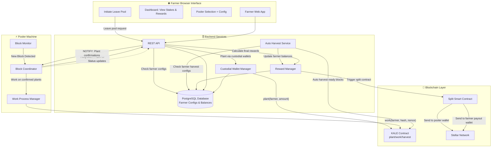

```mermaid
graph TB
    subgraph "🌐 Farmer Browser Interface"
        FW[Farmer Web App]
        FD[Dashboard: View Stakes & Rewards]
        FP[Pooler Selection + Config]
        FR[Initiate Leave Pool]
    end
    
    subgraph "🗄️ Backend Services"
        API[REST API]
        WALLET[Custodial Wallet Manager]
        HARVEST_SVC[Auto Harvest Service]
        REWARD_MGR[Reward Manager]
        DB[(PostgreSQL Database<br/>Farmer Configs & Balances)]
    end
    
    subgraph "⚡ Pooler Machine"
        MONITOR[Block Monitor]
        COORD[Block Coordinator]
        WORK_MGR[Work Process Manager]
    end
    
    subgraph "🔗 Blockchain Layer"
        KALE[KALE Contract<br/>plant/work/harvest]
        SPLIT_SC[Split Smart Contract]
        STELLAR[Stellar Network]
    end
    
    %% 🎯 CORRECTED PLANT FLOW
    MONITOR -->|"New Block Detected"| COORD
    COORD -->|"REQUEST: Plant for farmers"| API
    API -->|"Check farmer configs"| DB
    API -->|"Plant via custodial wallets"| WALLET
    WALLET -->|"plant(farmer, amount)"| KALE
    API -->|"NOTIFY: Plant confirmations"| COORD
    COORD -->|"Work on confirmed plants"| WORK_MGR
    WORK_MGR -->|"work(farmer, hash, nonce)"| KALE
    
    %% 🏆 AUTO HARVEST FLOW  
    HARVEST_SVC -->|"Check farmer harvest configs"| DB
    HARVEST_SVC -->|"Auto harvest ready blocks"| KALE
    HARVEST_SVC -->|"Update farmer balances"| REWARD_MGR
    REWARD_MGR --> DB
    
    %% 🚪 EXIT FLOW
    FR -->|"Leave pool request"| API
    API -->|"Calculate final rewards"| REWARD_MGR
    REWARD_MGR -->|"Trigger split contract"| SPLIT_SC
    SPLIT_SC -->|"Send to pooler wallet"| STELLAR
    SPLIT_SC -->|"Send to farmer payout wallet"| STELLAR
    
    %% 📱 FARMER INTERACTION
    FW --> API
    API --> DB
    
    %% 💾 DATA PERSISTENCE
    WALLET --> DB
    COORD -.->|"Status updates"| API
```