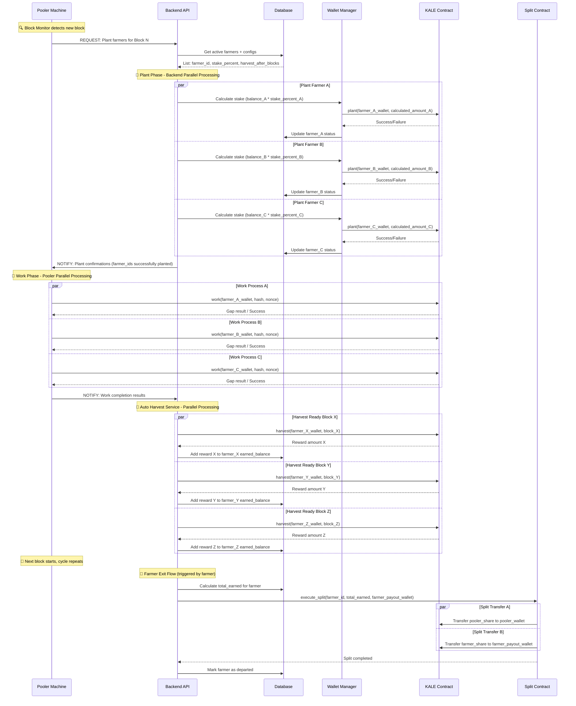

```mermaid

sequenceDiagram
    participant P as Pooler Machine
    participant API as Backend API
    participant DB as Database
    participant W as Wallet Manager
    participant K as KALE Contract
    participant SC as Split Contract
    
    Note over P: 🔍 Block Monitor detects new block
    P->>API: REQUEST: Plant farmers for Block N
    API->>DB: Get active farmers + configs
    DB-->>API: List: farmer_id, stake_percent, harvest_after_blocks
    
    Note over API: 🌱 Plant Phase - Backend Parallel Processing
    par Plant Farmer A
        API->>W: Calculate stake (balance_A * stake_percent_A)
        W->>K: plant(farmer_A_wallet, calculated_amount_A)
        K-->>W: Success/Failure
        W->>DB: Update farmer_A status
    and Plant Farmer B
        API->>W: Calculate stake (balance_B * stake_percent_B)
        W->>K: plant(farmer_B_wallet, calculated_amount_B)
        K-->>W: Success/Failure
        W->>DB: Update farmer_B status
    and Plant Farmer C
        API->>W: Calculate stake (balance_C * stake_percent_C)
        W->>K: plant(farmer_C_wallet, calculated_amount_C)
        K-->>W: Success/Failure
        W->>DB: Update farmer_C status
    end
    
    API->>P: NOTIFY: Plant confirmations (farmer_ids successfully planted)
    
    Note over P: 💪 Work Phase - Pooler Parallel Processing
    par Work Process A
        P->>K: work(farmer_A_wallet, hash, nonce)
        K-->>P: Gap result / Success
    and Work Process B
        P->>K: work(farmer_B_wallet, hash, nonce)
        K-->>P: Gap result / Success
    and Work Process C
        P->>K: work(farmer_C_wallet, hash, nonce)
        K-->>P: Gap result / Success
    end
    
    P->>API: NOTIFY: Work completion results
    
    Note over API: 🚜 Auto Harvest Service - Parallel Processing
    par Harvest Ready Block X
        API->>K: harvest(farmer_X_wallet, block_X)
        K-->>API: Reward amount X
        API->>DB: Add reward X to farmer_X earned_balance
    and Harvest Ready Block Y
        API->>K: harvest(farmer_Y_wallet, block_Y)
        K-->>API: Reward amount Y
        API->>DB: Add reward Y to farmer_Y earned_balance
    and Harvest Ready Block Z
        API->>K: harvest(farmer_Z_wallet, block_Z)
        K-->>API: Reward amount Z
        API->>DB: Add reward Z to farmer_Z earned_balance
    end
    
    Note over P: 🔄 Next block starts, cycle repeats
    
    Note over API: 🚪 Farmer Exit Flow (triggered by farmer)
    API->>DB: Calculate total_earned for farmer
    API->>SC: execute_split(farmer_id, total_earned, farmer_payout_wallet)
    
    par Split Transfer A
        SC->>K: Transfer pooler_share to pooler_wallet
    and Split Transfer B
        SC->>K: Transfer farmer_share to farmer_payout_wallet
    end
    
    SC-->>API: Split completed
    API->>DB: Mark farmer as departed

```