# Farmer Onboarding & Pool Joining - Complete Flow Design

## 🏗️ **System Architecture Overview**

```mermaid
graph TB
    subgraph "🌐 Farmer Interface"
        REG[Registration Portal]
        POOL[Pool Selection]
        DASH[Dashboard]
    end
    
    subgraph "🗄️ Backend Services"
        API[REST API Server]
        WALLET[Custodial Wallet Manager]
        MONITOR[Balance Monitor]
        POOLMGR[Pool Manager]
    end
    
    subgraph "📊 Database"
        USERS[users table]
        FARMERS[farmers table] 
        POOLERS[poolers table]
        CONTRACTS[pool_contracts table]
    end
    
    subgraph "🔗 Blockchain"
        CUSTODIAL[Custodial Wallets]
        EXTERNAL[External Wallets]
        STELLAR[Stellar Network]
    end
    
    %% Registration Flow
    REG --> API
    API --> WALLET
    WALLET --> CUSTODIAL
    API --> USERS
    API --> FARMERS
    
    %% Pool Joining Flow
    POOL --> API
    API --> POOLMGR
    POOLMGR --> CONTRACTS
    
    %% Monitoring
    MONITOR --> STELLAR
    MONITOR --> FARMERS
```



## 🔄 **Farmer Registration Flow**


## 🏊 **Pool Joining Flow**

```mermaid
sequenceDiagram
    participant U as User Browser
    participant API as Backend API
    participant PM as Pool Manager
    participant DB as Database
    participant SC as Smart Contract
    
    Note over U,SC: 🏊 POOL JOINING WORKFLOW
    
    rect rgb(240, 240, 255)
        Note over U,SC: 1️⃣ Pool Discovery & Selection
        
        U->>API: GET /poolers<br/>{"userId": "uuid"}
        API->>DB: SELECT poolers with reward rates and capacity
        DB-->>API: Available poolers list
        API-->>U: Poolers with reward rates and stats
        
        U->>API: GET /pooler/:id/details
        API->>DB: SELECT pooler details, current farmers, performance
        DB-->>API: Detailed pooler information
        API-->>U: Pooler statistics and terms
    end
    
    rect rgb(255, 240, 255)
        Note over U,SC: 2️⃣ Pool Configuration & Joining
        
        U->>API: POST /join-pool<br/>{"userId": "uuid", "poolerId": "uuid", "stakePercentage": 0.8, "harvestInterval": 5}
        
        API->>DB: Validate user is funded and not in another pool
        
        alt User eligible
            Note over API: 📋 Create Pool Contract Terms
            API->>PM: createPoolContract(user, pooler, config)
            PM->>DB: INSERT pool_contracts (farmer_id, pooler_id, stake_pct, harvest_interval, reward_split, status='pending')
            
            API-->>U: Pool contract terms<br/>{"contractId": "uuid", "terms": {...}, "requiresConfirmation": true}
            
            Note over U: User reviews terms and confirms
            
            U->>API: POST /confirm-pool-join<br/>{"contractId": "uuid", "confirmed": true}
            
            API->>DB: UPDATE pool_contracts SET status='active', confirmed_at=NOW()
            API->>DB: UPDATE farmers SET pooler_id=?, status='active_in_pool'
            API->>DB: UPDATE poolers SET current_farmers=current_farmers+1
            
            API-->>U: Successfully joined pool - Will participate in next block
            
        else User not eligible
            API-->>U: Error: User not funded or already in pool
        end
    end
```



## 🗄️ **Database Schema Updates**


## 🎯 **Pool Selection Interface Data**

```mermaid
graph LR
    subgraph "📊 Pooler Statistics Display"
        POOL1["🏊 Pooler Alpha<br/>Reward: 60% to farmers<br/>Capacity: 45/100<br/>Success Rate: 96%<br/>Avg Reward/Block: 2.3 KALE"]
        POOL2["🏊 Pooler Beta<br/>Reward: 55% to farmers<br/>Capacity: 80/150<br/>Success Rate: 94%<br/>Avg Reward/Block: 2.1 KALE"]
        POOL3["🏊 Pooler Gamma<br/>Reward: 65% to farmers<br/>Capacity: 12/50<br/>Success Rate: 98%<br/>Avg Reward/Block: 2.5 KALE"]
    end
    
    subgraph "⚙️ Configuration Options"
        STAKE["Stake Percentage<br/>🎚️ 20% - 100%<br/>Higher = More rewards & risk"]
        HARVEST["Harvest Interval<br/>🎚️ 1 - 20 blocks<br/>How often to collect"]
        TERMS["Contract Terms<br/>📋 Platform fee: 5%<br/>Exit delay: 24 hours"]
    end
    
    POOL1 --> STAKE
    POOL2 --> STAKE
    POOL3 --> STAKE
    STAKE --> HARVEST
    HARVEST --> TERMS
```



## ⚡ **Planting Integration Flow**


## 🔄 **Complete User Journey**


## 🎯 **API Endpoints Required**

### **Registration & Onboarding**
```http
POST /register
POST /check-funding
GET /user/status
```

### **Pool Management**
```http
GET /poolers
GET /pooler/:id/details
POST /join-pool
POST /confirm-pool-join
POST /exit-pool
```

### **Enhanced Plant Endpoint**
```http
POST /plant
# Now uses pool_contracts table to determine:
# - Which farmers are active in the pool
# - Individual stake percentages per farmer
# - Contract-specific terms and conditions
```

## 🔧 **Configuration Management**

### **Pooler Configuration**
```json
{
  "pooler": {
    "rewardPercentage": 0.60,
    "maxFarmers": 100,
    "minimumStake": 100000000,
    "platformFee": 0.05,
    "terms": {
      "exitDelay": 24,
      "penaltyConditions": "...",
      "performanceRequirements": "..."
    }
  }
}
```

### **Farmer Configuration**
```json
{
  "farmer": {
    "stakePercentage": 0.80,
    "harvestInterval": 5,
    "autoReinvest": false,
    "exitStrategy": "immediate"
  }
}
```

## 🎯 **Implementation Priority**

### **Phase 1: Core Registration (Week 1)**
1. User registration with email and external wallet
2. Custodial wallet generation and storage
3. Balance monitoring and funding confirmation
4. Basic user status management

### **Phase 2: Pool Discovery (Week 2)**
1. Pooler listing with reward rates and statistics
2. Pool selection interface and configuration
3. Pool contract creation and confirmation
4. Integration with existing plant operations

### **Phase 3: Advanced Features (Week 3)**
1. Pool performance analytics and comparison
2. Dynamic configuration updates
3. Exit flow and contract termination
4. Email verification system

---

This comprehensive design provides the complete farmer onboarding and pool joining workflow, integrating seamlessly with your existing Backend and Pooler services while maintaining the custodial wallet approach and flexible reward structures.