# Work Phase – Complete Implementation Plan (Phase 3)

## 🎯 **Executive Summary**

**Objective:** Implement the full **Work Phase** of KALE pool mining, where the pooler (central miner) executes hashing on behalf of farmers who successfully planted. This phase ensures fair distribution, efficient processing, and proper error recovery.

**Scope:** Work execution, recovery handling, batch reporting to backend, and integration with planting & harvesting phases.

**Key Deliverable:** End-to-end flow from planting → work execution → backend reporting, with error handling and compensation tracking.

---

## 🏗️ **System Architecture Overview**

```mermaid
graph TB
    subgraph "⚡ Pooler Service"
        PC[Pooler Coordinator]
        WM[Work Manager]
        RC[Recovery Workers]
    end

    subgraph "🗄️ Backend Service"
        API[REST API Server]
        DB[(PostgreSQL)]
    end

    subgraph "🔗 Blockchain"
        KALE[KALE Contract]
    end

    %% Flow
    PC --> WM
    WM --> KALE
    RC --> KALE
    WM --> PC
    PC --> API
    API --> DB
    API --> KALE
```



---

## 🔄 **Work Phase Flow**

```mermaid
sequenceDiagram
    participant PC as Pooler Coordinator
    participant WM as Work Manager (Miner)
    participant RC as Recovery Worker
    participant API as Backend API
    participant DB as Database
    participant KALE as KALE Contract

    Note over PC,KALE: ⚡ Phase 3: Work Execution & Reporting

    rect rgb(255, 248, 240)
        Note over PC: 1️⃣ Wait Period
        PC->>PC: After planting, wait 4 min delay
    end

    rect rgb(240, 255, 240)
        Note over PC,KALE: 2️⃣ Sequential Work Execution
        loop For each planted farmer
            PC->>WM: startWork(farmer_id, custodial_wallet)
            WM->>KALE: work(wallet, hash, nonce)

            alt Success
                KALE-->>WM: success (nonce, hash, zeros, gap)
                WM-->>PC: workResult(success)
            else Failure
                KALE-->>WM: failure
                WM-->>PC: workResult(failed)

                Note over PC: 🚑 Spawn recovery
                PC->>RC: startRecovery(farmer_id)
                RC->>KALE: retryWork(wallet)
                KALE-->>RC: success/failure
                RC-->>PC: recoveryResult
            end
        end
    end

    rect rgb(240, 240, 255)
        Note over PC: 3️⃣ Result Collection & Batch Submission
        PC->>PC: Collect all results (success, failed, recovered)
        PC->>API: POST /api/v1/pooler/work-complete {batch_results}

        API->>DB: INSERT works (per farmer)
        API->>KALE: submitWorkTx(successful farmers)

        API-->>PC: {work_recorded, ready_for_harvest, compensation_due}
    end
```



---

## 🗂️ **Work Result Payload**

```json
{
  "block_index": 12345,
  "pooler_id": "uuid",
  "work_results": [
    {
      "farmer_id": "farmer-uuid-1",
      "status": "success",
      "nonce": 746435291,
      "hash": "0000000f98c4740b898b6584be9e9217...",
      "zeros": 6,
      "gap": 15,
      "work_time": 45.2,
      "attempts": 1
    },
    {
      "farmer_id": "farmer-uuid-2",
      "status": "recovered",
      "nonce": 91234111,
      "hash": "0000000038b9294b712ec48e2...",
      "zeros": 7,
      "gap": 16,
      "work_time": 92.8,
      "attempts": 2
    },
    {
      "farmer_id": "farmer-uuid-3",
      "status": "failed",
      "error": "miner_crash",
      "compensation_required": true
    }
  ],
  "timestamp": "2025-02-01T10:35:00Z"
}
```

---

## 🗄️ **Database Schema Updates**


---

## 🔌 **API Route Specification**

### **Work Completion Notification**

```http
POST /api/v1/pooler/work-complete
Headers:
  Authorization: Bearer {pooler_api_key}
  Content-Type: application/json

Request Body:
{
  "block_index": 12345,
  "pooler_id": "uuid-string",
  "work_results": [...],
  "timestamp": "2025-02-01T10:35:00Z"
}

Response: 200 OK
{
  "success": true,
  "work_recorded": 45,
  "compensation_amount": 1000000000,
  "ready_for_harvest": [
    "farmer-uuid-1",
    "farmer-uuid-2"
  ]
}
```

---

## ⚙️ **Configuration Management**

### **Pooler Configuration**

```bash
# Work Execution
WORK_DELAY_MINUTES=4
MAX_FARMERS_CAPACITY=50
WORK_EXECUTION_MODE=sequential
RECOVERY_ENABLED=true
RECOVERY_MAX_ATTEMPTS=3
RECOVERY_TIMEOUT_SECONDS=60
```

### **Backend Configuration**

```bash
# Work Handling
WORK_BATCH_TIMEOUT=300
WORK_VALIDATION_ENABLED=true
COMPENSATION_ENABLED=true
```

---

## 🚀 **Implementation Timeline**


---

## 🎯 **Phase 3 Deliverables Checklist**

### ✅ Pooler Deliverables

* [ ] Sequential work executor for planted farmers
* [ ] Recovery worker system for failed farmers
* [ ] Batch result aggregation & reporting
* [ ] Configurable retry & timeout settings

### ✅ Backend Deliverables

* [ ] Work result ingestion & validation
* [ ] Immediate KALE contract submission for successful work
* [ ] Compensation tracking for pooler failures
* [ ] Database schema updates for works & compensations

### ✅ Integration & Testing

* [ ] End-to-end flow: plant → work → harvest
* [ ] Failure simulation with recovery retries
* [ ] Compensation logic validation
* [ ] Monitoring & logging improvements

---

## 🔑 **Critical Success Factors**

* **Efficient Work Execution:** Sequential processing ensures resource safety.
* **Stake Protection:** Recovery processes minimize farmer losses.
* **Immutable Tracking:** All work recorded in DB for auditing.
* **Fair Compensation:** Clear rules when pooler fails to deliver.

---

## 🎯 **Success Metrics**

* **Work Success Rate:** > 95% (with recovery)
* **Recovery Success Contribution:** > 80% of failed works recovered
* **Compensation Accuracy:** 100% of failed farmers compensated
* **API Response Time:** < 5s for batch submission
* **Block Participation Rate:** > 95% farmers included in work phase

---

This Phase 3 plan fully details the **Work Phase** execution, integrating planting success into coordinated hashing by the pooler, with robust recovery, compensation, and backend validation.
